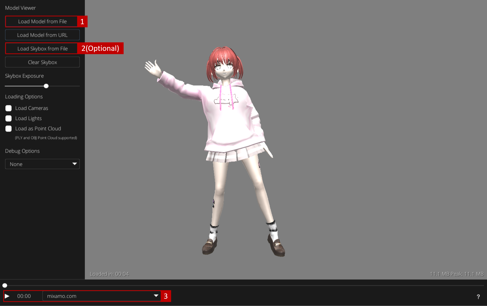

# Model Demo Environment

**[Enter Model Demo Environment](https://evan901010.github.io/demo_environment/)**

This project is exclusively for experimental simulations conducted by Professor [Jen-Chun Lin](https://sites.google.com/site/jenchunlin/) at Academia Sinica, Taipei, Taiwan.

## Quick Start

Follow the instructions in the image below to test if the agent's actions match your expectations.

### Image Description

1. Upload the model (.fbx) from your local device.
2. (Optional) Load a skybox as the background.
3. Verify that the animation is correct and press the start button.

## Developer Notes

- [ ] Add additional stages and formal backgrounds.
- [ ] Add one-click recording.

