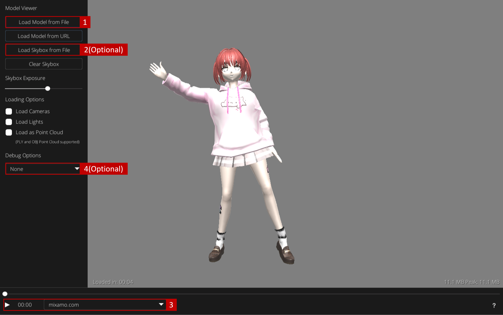

# Model Demo Environment

**[Enter Model Demo Environment](https://evan901010.github.io/demo_environment/)**

This project is exclusively for experimental simulations.

For tutirial video, please refer to [SMPL-to-Agent Tutorial Video](https://www.youtube.com/watch?v=ggvJGfux340&ab_channel=%E8%83%A1%E7%A5%90%E8%8F%AF)

For relative materials provided in tutirial video, please refer to [Agent Animation Retargeting](https://github.com/evan901010/demo_environment/tree/main/Agent%20Animation%20Retargeting)

## Keyboard Shortcut
<kbd>H</kbd> - Hide/Show UI 

## Quick Start

Follow the instructions in the image below to test if the agent's actions match your expectations.

### Image Description

1. Upload the model (.fbx) from your local device.
2. (Optional) Load a skybox as the background.
3. Verify that the animation is correct and press the start button.
4. (Optional) Visualize the bones or joints if you need further debug

